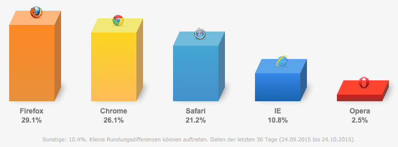
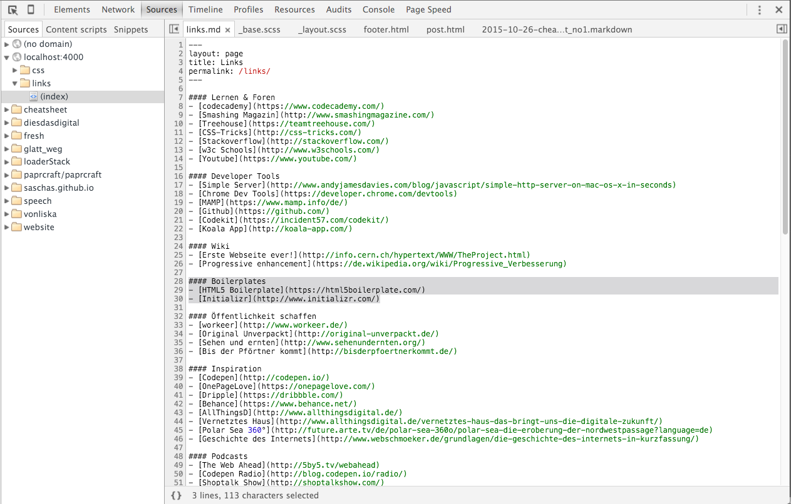
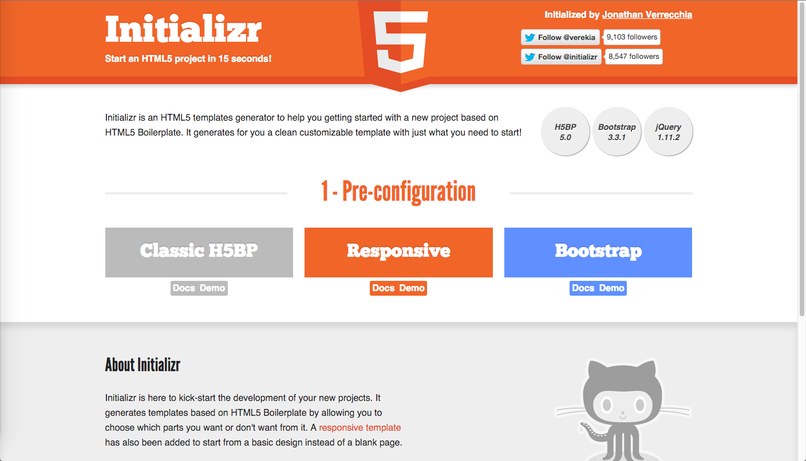

## Technologie 1 
# **Übung**
---
## [fit] Online Portfolio
---


## Cheatsheet

+ Zusammenfassung
+ Alle erstellten Pens

---


## Codepen
Kostenloser HTML, CSS & Javascript Editor im Browser

+ _Ein Pen pro Woche_ __Freitag 24Uhr__
+ _jede Woche_ ein neuer Hashtag(#)

---
## Abgabe

_.zip Datei_

+ HTML, CSS & Javascript

_Internetseite_

+ Domain (+ serverseitige Dateien)

---
## Überblick
+ Webarchitektur - Aufbau des Internets
+ Developer Tools
+ _HTML_ Hypertext Markup Language
+ _CSS_ Preprocessor
+ _Javascript_ jQuery
+ _Animation_ CSS / Javascript
+ Static Site Generatoren

---
## Mindsets
+ _Warum_ soll ich programmieren lernen?
+ _Progressive Enhancement_ vs _graceful degradation_
+ Separation of concerns
+ _Mobile First_ vs _desktop first_

---
# HTML
- Doctype
- Semantic Markup
- Externe Files einbinden
- `<audio>`,`<video>`
- `<canvas>`

---

# Grundlagen Javascript
- `functions`, `Loops`, `Arrays`

- __jQuery__ Select and Do
- __dynamisches Laden von Inhalten__ Ajax
    - externe Daten laden
    - JSON parsen

---                                

## Static Site Generator und Templating

+ __Jekyll__
+ Middleman
+ Mustache

---

## Warum soll ich programmieren lernen?
---
#### Klassische Workflow


---
#### Iterative Workflow


---
## Geringe Einstiegshürden
+ Voraussetzungen sind PC + Internet : )
+ Ortunabhängig

---

## Warum?
+ Die eigene Umgebung verstehen
+ Prototypen entwickeln
+ Selbstständig Ideen umsetzen
+ Agenturen erwarten häufig ein Mindestverständnis                  
+ Auf Augenhöhe mit Entwicklern kommunizieren
+ _Wissen inspiriert!_

---

## Vielseitig einsetzbar
- _Kommunizieren_
- Online Präsentation
- Werke verkaufen
- Games
- Wirtschaft
- Wissenschaft                          

---
## Öffentlichkeit schaffen
+ Für euch (Portfolio)
+ Für eure Ideen
   - [workeer](http://www.workeer.de/)
   - [ou](http://original-unverpackt.de/)
   - [Bis der Pförtner kommt](http://bisderpfoertnerkommt.de/)
+ Gründet eure eigene Community
    - [Greyscalegorilla](http://greyscalegorilla.com/)
    - [CSS Tricks](http://css-tricks.com/)
    - [Video Copilot](http://www.videocopilot.net/)

---

## Internet der Dinge
- Vernetztes Haus
- Autos können miteinander kommunizieren Stau 
    - umfahren / verhindern 
    - Parkplätze werden automatisch zugewiesen
- Virtual Reality

---


---


---


---
## Inspiration
---

### codepen
---


### dribbble
---


###  Behance

---

### One Page Love
---

### Pinterest
---

### Der Aufbau des Internets


---


### [Internetmap](http://internet-map.net/)

---
## Server und Client
- kommunizieren über ein Protokoll (z.B. über HTTP oder FTP)-
- **HTTP** = HyperTextTransferProtocol
- **FTP** = FileTransferProtocol

---


## HTTP

---

##### Detail

---

### URL (Uniform Resource Locator)

assets/img/url.png

---

## TDL

- Top Level Domain

- Länderkennung

.com, .org, .de, .info, .berlin, .haus, .immobilien, .jetzt, .kaufen, .reise, .reisen, .schule, .versicherung...+

---


---


### Browserübersicht


---

### Browserverteilung
---

### Renderprozess

---


--- 


---


---


# [Initializr](http://www.initializr.com/)
---

## HTML Hypertext Markup Language 

>Die _Hypertext Markup Language_, abgekürzt HTML, ist eine textbasierte Auszeichnungssprache zur Strukturierung von Inhalten wie Texten, Bildern und Hyperlinks in Dokumenten. HTML-Dokumente sind die Grundlage des World Wide Web und werden von einem Webbrowser dargestellt.

-- HTML Definition

---

### HTML Aufbau
- Dateiendung _.html_
- Markup-/Auszeichnungs- Sprache (__SGML__)
- `<!--Kommentare sehen so aus-->`
- HTML Dokumente bestehen _immer_ aus einem 
    - `<!doctype html>`
    - `<head>`
    - `<title>`
    - `<body>`

---

### Der Doctype
*Document Type Declaration* [im Detail](http://www.sitepoint.com/a-basic-html5-template/)

`<!DOCTYPE>` legt die __Document Type Definition__ (DTD) des Dokuments fest. Die DTD bestimmt die Grammatik und die Syntax der HTML-Sprache

Kurz gesagt: Der Dokumententyp am Anfang einer HTML-, XHTML, XML-Datei gibt an, um welchen Typ von Dokument es sich handelt. - [Definition](http://www.mediaevent.de/xhtml/doctype.html)

---

### Verschiedene Doctypes für __HTML__
```html
<!--xhtml 1.0-->
<!DOCTYPE html PUBLIC "-//W3C//DTD XHTML 1.0 Strict//EN"
   "http://www.w3.org/TR/xhtml1/DTD/xhtml1-strict.dtd">
```
```html
<!--HTML4-->
<!DOCTYPE HTML PUBLIC "-//W3C//DTD HTML 4.01 Transitional//EN"
   "http://www.w3.org/TR/html4/loose.dtd">
```
```html
<!--HTML5-->
<!doctype html>
```

---

### <head>

- Der _<head> Bereich_ wird nicht angezeigt
- `meta` Daten können in diesem Bereich definiert werden
- verschiedenste Dateien können hinzugeladen werden

---

```html
<head>
  <meta charset="utf-8">
  <title>HTML5 Basic Template</title>
  <meta name="description" content="HTML5 Basic Template">
  <meta name="author" content="Sascha Sigl">

  <link rel="stylesheet" href="css/styles.css?v=1.0">

  <!--[if lt IE 9]>
  <script src="http://html5shiv.googlecode.com/svn/trunk/html5.js"></script>
  <![endif]-->
</head>
```

---
### <body>
+ Der <body> Bereich wird angezeigt
+ Sämtlicher Content befindet sich innerhalb des <body> Tags

```html
<body>
    <!--Content wird hier dargestellt-->
</body>
```

---

### CSS hinzufügen

- _Im <head> Bereich_
`<style type="text/css">…</style>`
- _Inline_
`<p style="color:red">Text</p>`
- _Externes Stylesheet laden_
`<link rel="stylesheet" href="css/styles.css">`

---

### JS hinzufügen
+ _Im <head> des HTML Dokuments (Ausnahme)_ 
`<script type="text/javascript">`…
+ _Inline_
`<p onclick="tuWasFunktion();">Text</p>`
+ _Kurz vor dem geschlossenen </body> Tag werden externe Scripte geladen_
`<script type="text/javascript" src="js/javascript.js">`

---

### Inline oder Extern
+ _Vorteil_
+ Reduziert die HTTP Requests

+ _Nachteile_
+ Kann nicht seperat gecacht werden
+ Debuggen kaum möglich
+ Sicherheitsrisiken bei Inline JS


_99%: Externe Stylesheets oder Scripte verwenden!_

---

### CSS - Cascading Stylesheet
**Definition:** *Cascading Style Sheets, kurz CSS genannt, ist eine textbasierte Gestaltungssprache für die Formatierung strukturierter Dokumente.*

+ Dateiendung _.css_
+ Definiert die _Darstellung eines HTML Dokuments_
+ `/*Kommentare sehen so aus.*/`

---

### Syntax
```css
Selektor{
    Eigenschaft : Wert;
}
```
_Beispiel_
```css
/*Färbt den Hintergrund des Bodys rot*/
body{
    background:red;
}
```

--- 
### Top to Bottom
CSS wird von oben nach unten geparst, d.h. CSS-Regeln können überschrieben werden. Es gilt die Gewichtung von Selektoren zu beachten.

---

### Selektoren und ihre Gewichtung

```css
/*Kategorie 1 - Inline Style - nicht verwenden! Stärkster Selektor*/
<p style="color:red;">

/*Kategorie 2 - ID Selektor*/
#info

/*Kategorie 3 - Class Selektor, :pseudoClass Selektoren, Attribute Selektoren*/
.class
<tagName>:pseudoClass{}
<tagName>[attr="key"]{}

/*Kategorie 4 - einfacher Tagname - schwächster Selektor*/
<tagName>{}
```

---

### Selektoren und ihre Gewichtung
```css
body{
    background:red;
}
body{
    background:green;
}

/*Body wird grün angezeigt*/
```

---

# Achtung!           

``` css
body{
    background:red!important;
}

body{
    background:green;
}
```

---

### **!important**
Mit "!important" kann man eine zusätzliche Gewichtung dem Selektor mitgeben und ggf. eine vorher definierte Styleregel überschreiben 

```css
body{
    background:pink!important;
}
```

---
# [fit] Jetzt seid ihr dran!
---

**Eigene Webvisitenkarte erstellen**

+ Name Vorname
+ Bild                              
+ eMail Adresse
+ Kurzer Text über euch
    + Wie schätzt ihr eure Erfahrungen ein?
    + Wo liegen eure stärken?
    + Was interessiert euch am meisten?
+ Was erwartet ihr von diesem Kurs?


